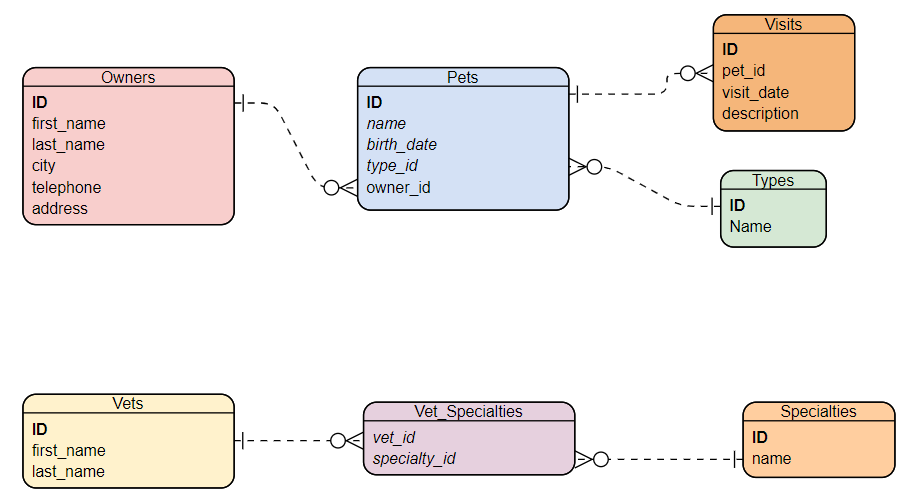

# Enunciado
## Ejercicio Final
Nos han encargado el mantenimiento de una aplicación de una clínica veterinaria. Nos la han entregado con fallos en el código los cuales no nos permite desplegar la aplicación.

También nos han encargado añadir una serie de funcionalidades nuevas.

Esta aplicación está usando una base de datos embebida compuesta de las siguientes tablas: 

 
 
## Requisitos Previos
Para realizar el ejercicio necesitaremos tener instalado:

•	Git https://github.com/git-for-windows/git/releases/tag/v2.5.3.windows.1
•	JDK 1.8
•	IDE Eclipse
•	Plugin Spring (Spring Tools 4 - for Spring Boot (aka Spring Tool Suite 4)

Una vez que tengamos todo, nos bajaremos del repositorio Git el proyecto

git clone https://gitlabdes.hiberus.com/vgimeno/testjava

Para lanza el proyecto deberemos hacer clic derecho sobre el proyecto -> Run As -> Spring Boot App

## Fallos
En total existen 4 errores que tienen que ser corregidos para poder seguir desarrollando.

Los dos primeros no nos permiten arrancar la aplicación por un error relacionado con la base de datos.

El resto son errores en tiempo de ejecución:
1.	Al pulsar sobre Edit Pet
2.	Al pulsar sobre Veterinarians

## Funcionalidades cortas
1. En el listado de “Owners” crear un botón que nos lleve de nuevo al buscador de “Owners”. 
2. En el buscador de "Owners" evitar que se puedan realizar búsquedas vacías. Solo permitir búsquedas si se ha introducido un mínimo de tres caracteres.

## Funcionalidades largas
1. Añadir en "Owners" una nueva columna de Fecha de Nacimiento. Dicha columna deberá será visible en el listado de “Owners” y podrá ser modificada dentro de “Edit Owner”.
2. Dentro de “Owner Information” añadir dos enlaces para Modificar y Borrar Visitas
3. Implementar las operaciones CRUD para "Veterinarians"
4. Implementar una paginación en base de datos para la tabla "Owners"

## Subir el Ejercicio
Una vez descargado del repositorio haremos una rama nueva donde subiremos los cambios.

Primero realizar un git flow init
Los cambios se realizarán en una rama de nombre <nombre_apellido>
Para crear la rama -> git flow feature start <nombre_apellido>
Para subir los cambios:
git add <ruta de la clase java>
git commit
git push

## Secuencia de resolución del ejercicio
El orden de resolución de la prueba deberá será ser:
1. Fallos
2. Funcionalidades cortas
3. Funcionalidades largas

Para validar la resolución de las pruebas solo es necesario la carpeta SRC, no todo el proyecto. 

Hasta que no se realice la entrega de al menos la resolución de los fallos, no se podrá abandonar el aula.
Para poder hacer un descanso, se entrega el fuente con la resolución de los fallos y se podrá continuar con el resto del examen posteriormente.

